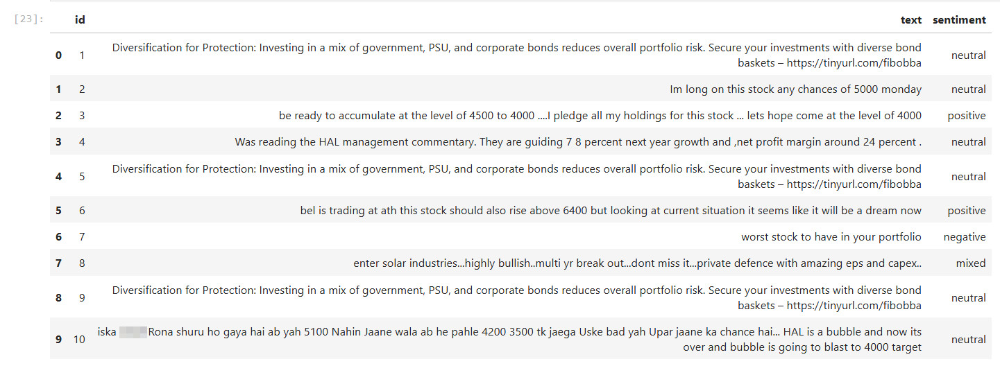
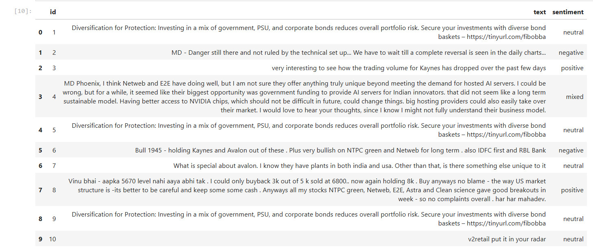
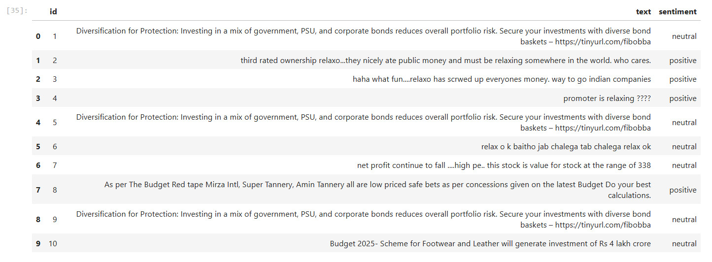

<!-- To view this page in VSCode use: Ctrl+Shift+V -->
# Quantify the sentiments of MoneyControl forum comments for a stock:

Source: As per the [Udemy lecture](https://tcsglobal.udemy.com/course/microsoft-azure-ai-services/learn/lecture/47485031#reviews) here, need to create below resources, but use Terraform instead:


## Create Resources: 

1. 1 x Resource Group 
2. 1 x Azure AI > Language Service > Kind=Text Analytics which has Sentiment Analytics feature
3. 1 x Azure Container Instance that would deploy [sentiment analytics container from MCR](https://learn.microsoft.com/en-us/training/modules/investigate-container-for-use-with-ai-services/3-use-ai-services-container).

## Cmd Command to invoke Sentinment analytics ACI:

```bash
curl -X POST "http://rasw-aci-eus-dev-sentianalyzer.eastus.azurecontainer.io:5000/text/analytics/v3.1/sentiment" -H "Content-Type: application/json" --data-ascii "{'documents':[{'id':1,'text':'The performance was amazing! The sound could have been clearer.'},{'id':2,'text':'The food and service were unacceptable. While the host was nice, the waiter was rude and food was cold.'}]}"

``` 


# Terraform Commands

## Create:

```hcl
terraform init
terraform plan -var-file="dev.tfvars" -input=false -out='tfplan.bin'
terraform apply -input=false 'tfplan.bin'
```

## Destroy:

```hcl
terraform plan -destroy -var-file="dev.tfvars" -input=false -out='tfplan-kill.bin'
terraform apply -destroy -input=false 'tfplan-kill.bin'
```

# Results:

## HAL Stock Sentiments on 25-May-2025:



## Kaynes Tech Stock Sentiments on 25-May-2025:


## HAL Stock Sentiments on 25-May-2025:

